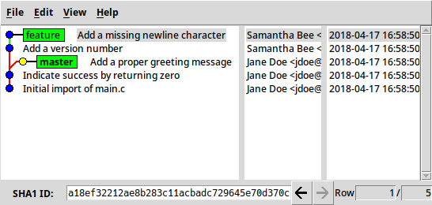

Visualizing Branches
--------------------

### Using `git log` to Visualize Branches ###

\
<!-- Placeholder -->

~~~ {.shell}
$ git log --oneline --abbrev-commit \
    --all --graph --decorate --color
~~~

~~~
* a18ef32 (feature) Add a missing newline character
* 72a4a7d Add a version number
| * b8f2277 (master) Add a proper greeting message
|/
* f259764 Indicate success by returning zero
* 29c4da1 Initial import of main.c
~~~

### Using `gitk` to Visualize Branches ###

Sometimes it's easier to use a GUI:

~~~ {.shell}
$ gitk --all
~~~

\
<!-- Placeholder -->
