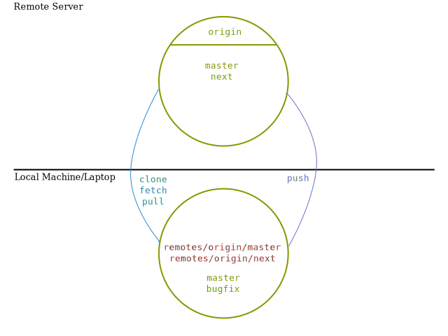
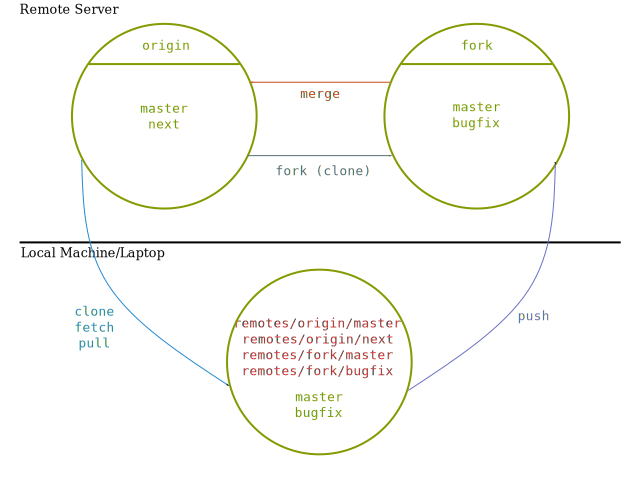

Remote Repositories
-------------------

### Listing Remotes ###

  * When you clone a repository it will have one remote by default: *origin*

  * The origin remote points back to the original clone URL

  * You can list remotes with the following command:

         $ git remote -v show

### Exercise: Listing Remotes ### {#ex-list}

  #. Go into any repository that we've used today

  #. List the remotes for that repository

  #. What does the `-v` flag do?

### Typical Remote Setup ###

\
<!-- Placeholder -->

### Dual Remote Setup (Fork) ###

\
<!-- Placeholder -->

### Adding Remotes ###

It's common to have more than one remote.  To add another remote you:

    $ git remote add <name> <url>

Reasons to have additional remotes:

  * Pull from a coworker's repo

  * Backup your repository without pushing to the central one

  * Creating a pull request on an open source project

### Renaming and Removing Remotes ###

You can rename a remote:

    $ git remote rename <old> <new>

or completely remove a remote from your repository:

    $ git remote remove <name>
