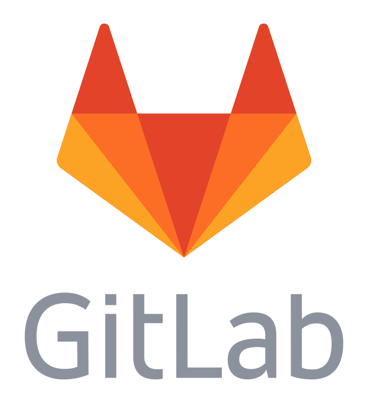

Introduction to GitLab
----------------------

### What is GitLab? ###

\
<!-- Placeholder -->

GitLab is a repository hosting and project management platform.

### Project Management Features ###

  * Git repository hosting (one per project)

  * Issue tracking (bug reports, request features, etc.)

  * User administration (i.e., who can work in a project)

  * Developer workflow management (i.e., branching and merge requests)

  * Milestone tracking and reporting

  * A bunch of other stuff...

Git Repositories on GitLab
--------------------------

### Project Repositories ###

  * Each project has its own Git repository

  * The repository can be managed from the web interface

  * The user interface prominently displays the clone URL

  * We'll talk more about cloning and forking in a bit

  <<(repositories.md)

Daily Workflow
--------------

  <<(workflow.md)
